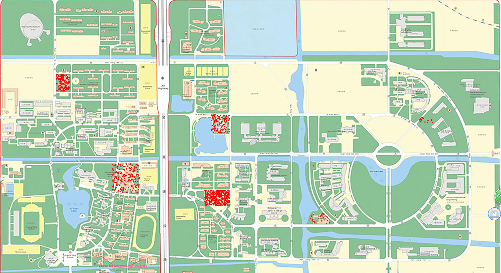
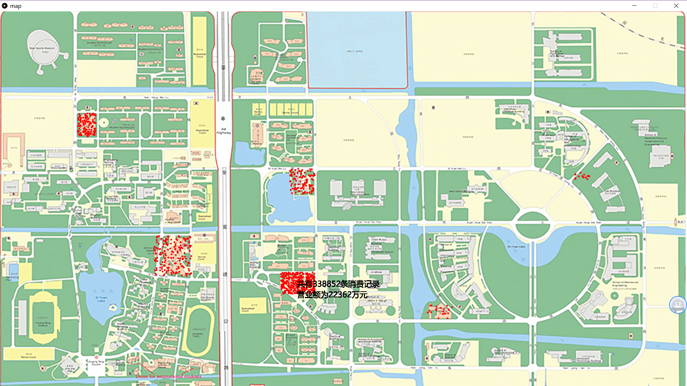
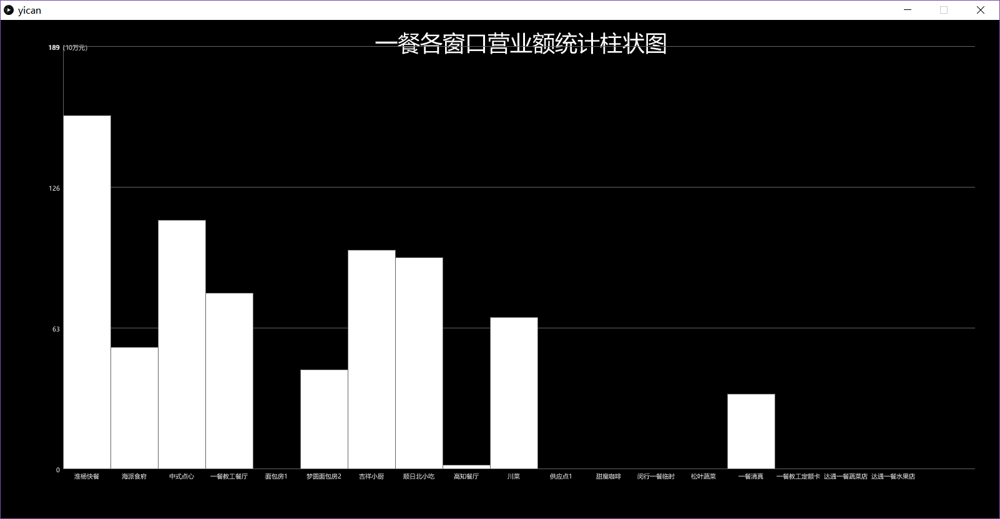

# DDDUR2018F_516202910008
·我所设计的数据可视化产品的功能为：1）在交大地图上六个餐饮大楼的实际位置上根据消费记录的多少进行画点；可根据各个餐饮大楼点数的多少明显地看出每个餐饮大楼的使用率；

2）当鼠标放置在各个餐饮大楼的区域时，会显示此餐饮大楼共有多少条消费记录及营业额；例如：当鼠标放置在第二餐饮大楼时，会显示第二餐饮大楼共有338852条消费记录，营业额为22362万元；

3）当鼠标放置在各个餐饮大楼的区域并点击时，会跳转到各个餐饮大楼下每个窗口的营业额；（现阶段暂未实现窗口之间的跳转，仅将每个餐饮大楼的各窗口营业额进行了统计；

·该产品的使用方式为通过鼠标的点击，进行各窗口之间的切换，得出各个餐饮大楼的使用率，营业额及每个餐饮大楼下各窗口的营业额；

基于该产品进行可视化的发现为：
1）各餐饮大楼的基本情况为：第一餐饮大楼共有169372条消费记录，营业额为7995万元；
                         第二餐饮大楼共有338852条消费记录，营业额为22362万元；
                         第三餐饮大楼共有108628条消费记录，营业额为8270万元；
                         第四餐饮大楼共有121224条消费记录，营业额为8671万元；
                         第五餐饮大楼共有21057条消费记录，营业额为1926万元；
                         第六餐饮大楼共有16736条消费记录，营业额为1229万元；
                         
各餐饮大楼的利用率从高到低为：第二餐饮大楼>第一餐饮大楼>第四餐饮大楼>第三餐饮大楼>第五餐饮大楼>第六餐饮大楼;
各餐饮大楼的营业额从高到低为：第二餐饮大楼>第四餐饮大楼>第三餐饮大楼>第一餐饮大楼>第五餐饮大楼>第六餐饮大楼;

2)第一餐饮大楼各窗口的营业额为：
淮扬快餐：18980941（元）
海派食府：6573057（元）
中式点心：13307236（元）
一餐教工餐厅：9498940（元）
面包房1：1500（元）
梦园面包房2：5397420（元）
吉祥小厨：11740625（元）
顺日北小吃：11334521（元）
高知餐厅：290140（元）
川菜：8141679（元）
供应点1:0（元）
甜魔咖啡:94410（元）
闵行一餐临时:0（元）
松叶蔬菜:0（元）
一餐清真:4035536（元）
一餐教工定额卡:1950（元）
达通一餐蔬菜店:0（元）
达通一餐水果店:0（元）

各窗口营业额从高到低为：
